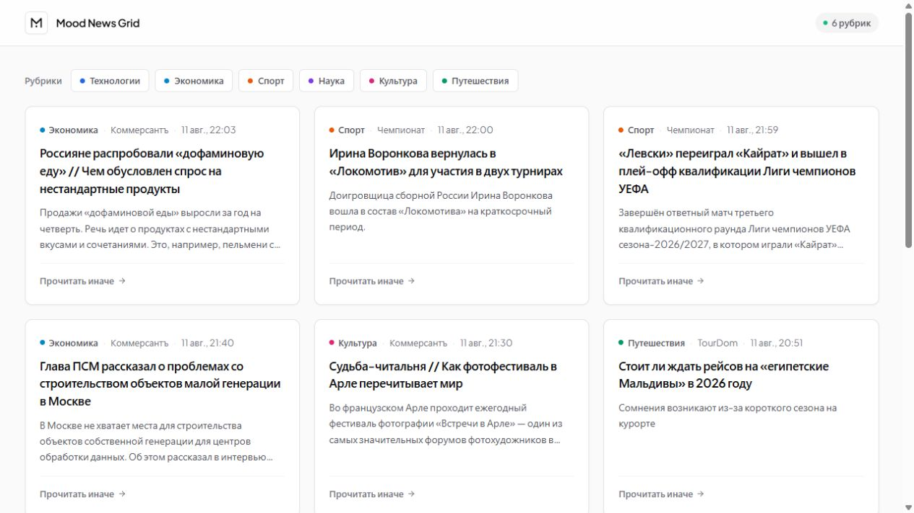
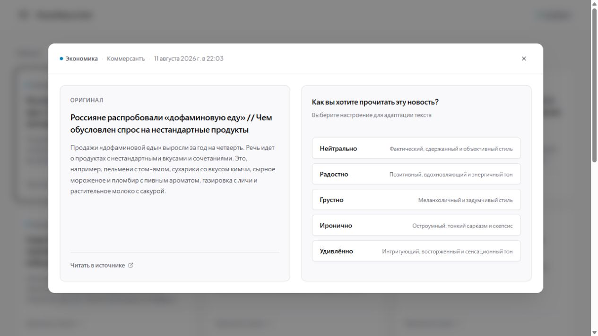
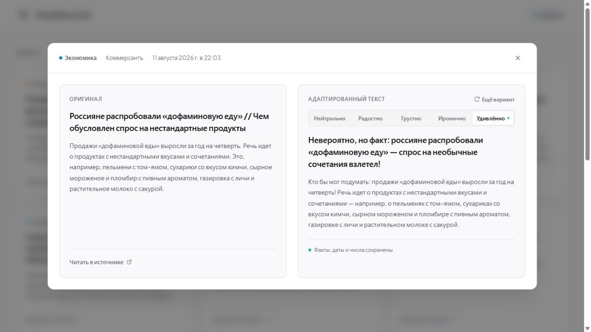

# Mood News Grid

Новостная лента, в которой реальные публикации можно читать в пяти эмоциональных режимах: нейтрально, радостно, грустно, иронично или удивлённо. Приложение сохраняет факты, показывает оригинал и адаптированный текст рядом и всегда оставляет ссылку на источник.

**Демо:** [mood-news-grid.vercel.app](https://mood-news-grid.vercel.app)

## Скриншоты







## Возможности

- 12 актуальных новостей в гриде 3 × 4;
- шесть рубрик: технологии, экономика, спорт, наука, культура и путешествия;
- пять вариантов настроения: нейтрально, радостно, грустно, иронично, удивлённо;
- параллельная неблокирующая генерация нескольких настроений одновременно;
- оригинальный и адаптированный тексты рядом;
- название издателя, время публикации и ссылка на оригинал;
- персональное сохранение готовых версий в браузере (`localStorage`);
- строгая фактологическая инвариантность при AI-адаптации.

## Как обновляется лента

При каждом запросе приложение заново проверяет RSS-ленты и не использует HTTP-кэш. В основном гриде показываются две самые свежие публикации из каждой рубрики.

Если в рубрике появляется одна новая статья, она занимает первое место, а предыдущая первая статья перемещается на второе. Если издатель выпустил сразу несколько материалов, более старые публикации могут выйти за пределы двух видимых мест этой рубрики. Их можно открыть кнопкой **«Показать другие новости»**.

## Источники

| Рубрика | RSS-источники |
| --- | --- |
| Технологии | Хабр Новости, Хабр, 3DNews |
| Экономика | Коммерсантъ |
| Спорт | Чемпионат, Sports.ru |
| Наука | N + 1 |
| Культура | Коммерсантъ |
| Путешествия | TourDom, АТОР |

Если основной источник временно недоступен, загрузчик пробует резервную ленту или использует сохранённые реальные статьи.

## Хранение данных

Структурированный снимок статей хранится в `.data/store.json`. При наличии `DATABASE_URL` тот же слой данных использует Neon Postgres и автоматически создаёт таблицу.

Для каждой статьи сохраняются заголовок, исходный текст, рубрика, издатель, URL, время публикации и хеш содержимого. Эмоциональные версии не записываются в общую базу: они сохраняются в `localStorage` браузера пользователя. Поэтому у каждого пользователя собственный независимый набор рерайтов.

## AI и контроль фактов

Рерайт выполняется прямым запросом к Polza.ai с моделью `openai/gpt-5.6-luna` и гарантированным форматом **Strict JSON Schema** (`title`, `text`, `mood`).

Системный промпт отделяет исходную новость от инструкций и обеспечивает баланс художественной свободы и точности:
* **Фактическая инвариантность:** модель строго сохраняет проверяемые факты (имена, организации, числовые значения, проценты, даты, модальность утверждений и причинно-следственные связи).
* **Стилистическая выразительность:** модель свободна применять журналистские переформулировки, метафоры и акценты, органичные для выбранного тона, не привязываясь к искусственным шаблонам.
* **Неблокирующий UI:** клиентское приложение поддерживает независимые параллельные запросы к API для каждого настроения с индикацией статуса на вкладках.

## Соответствие заданию

| Требование | Реализация |
| --- | --- |
| Минимум 10 реальных новостей | 12 актуальных RSS-публикаций |
| Структурированное хранилище | JSON, опционально Neon Postgres |
| Новостной грид | 4 ряда по 3 карточки |
| Переключатель настроения | 5 режимов с параллельной генерацией |
| Оригинал и рерайт рядом | Модальное окно с двумя текстами |
| Ссылка на источник | У каждой публикации |
| Контроль фактов | Строгая фактологическая инвариантность и JSON Schema |

## Локальный запуск

Требуется Node.js 20 или новее.

```bash
npm install
```

Создайте `.env.local`:

```env
POLZA_API_KEY=your_polza_api_key

# Необязательно
POLZA_BASE_URL=https://polza.ai/api/v1
POLZA_MODEL=openai/gpt-5.6-luna
DATABASE_URL=
```

```bash
npm run dev
```

Откройте [http://localhost:3000](http://localhost:3000). Без `POLZA_API_KEY` лента и оригинальные тексты доступны, но генерация эмоциональных версий отключена.

## Проверка проекта

```bash
npm test
npm run typecheck
npm run build
```

## API

- `GET /api/news` — получить 12 свежих карточек;
- `POST /api/news/:id/rewrite?mood=surprised` — создать и проверить персональный рерайт.
